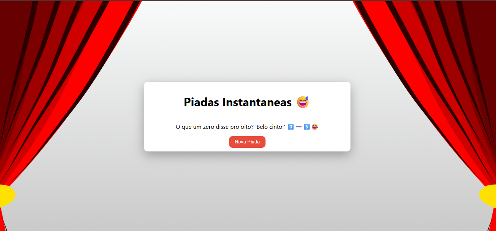

# 😅 Piadas Instantâneas

Uma API leve que entrega **piadas aleatórias** em JSON para sua página HTML, perfeita pra dar umas risadas rápidas ou treinar habilidades com **Node.js, Express e Docker**.

[](https://github.com/Otavio72/Piadas-Instantaneas/blob/main/LICENSE)  

---

## 🚀 Funcionalidades

- 📩 **API REST:** Endpoints simples que retornam piadas em JSON.  
- 📱 **Layout responsivo:** Funciona tanto em desktop quanto em mobile.  
- 📦 **Deploy pronto:** Docker + Render para rodar sem complicação.  
- ⚡ **Piadas instantâneas:** Cada refresh ou chamada à API traz uma piada nova.

---

## 💻 Layout da aplicação

### Página inicial


*(Dica: adicionar um GIF mostrando a piada mudando em tempo real deixa mais dinâmico.)*

---

## 🛠 Tecnologias utilizadas

### 🔙 Back end
- Node.js  
- Express

### 🎨 Front end
- HTML  
- CSS

### 📦 Deploy
- Docker  
- Render

---

## ⚙️ Como executar o projeto

### Localmente
```bash
git clone https://github.com/Otavio72/Piadas-Instantaneas.git
cd Piadas-Instantaneas
npm install
npm start
```
## 📦 Com Docker
```bash
docker build -t piadas-instantaneas
docker run -p 3000:3000 piadas-instantaneas
```
Depois acesse: http://localhost:3000

## 💻 Online
[Piadas Instantâneas](https://piadas-instantaneas.onrender.com)

# Autor
Otávio Ribeiro
[🔗LinkedIn](https://www.linkedin.com/in/otávio-ribeiro-57a359197)
